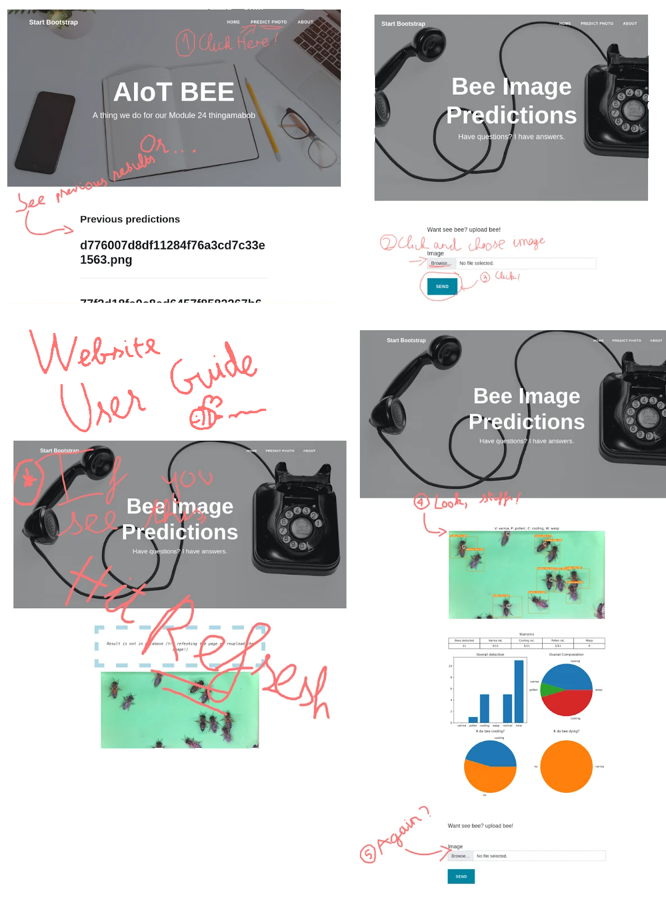

# Test website to do stuff with the AI predicting thing

## How to run

> ### Note:
> This project assumes you have a mongodb instance running on the local machine @ port 27017

> This project also assumes you have a python environment with pip and a NodeJS environment. They can be separated as long as access to the required folders (`public/upload` and `public/output`) and the MongoBD port is guaranteed.

### Add a pre-train model to `Saved`

(Look inside `ExampleModels` for more information):

### Install dependencies & run Python component:
Installing dependencies:
> NOTE: it is recommended to setup and activate a [Python virtual environment](https://realpython.com/python-virtual-environments-a-primer/) to avoid conflicting dependencies.
```bash
python -m pip install -r requirements.txt 
```

#### (OPTIONAL) enable the YOLOv7 component:
The YoloV7 model component offers a more accurate object detection than the OpenCV method. The downside that is it's bulky.
>NOTE: the `opencv-python` dependency in yolo will replace the project's `opencv-python-headless` dependency. This shouldn't cause issue as long as you don't try to run the python component in a headless environment (like in a docker container for example). <br>
> If you actually need `opencv-python-headless`, then just install every other requirements except `opencv-python` and it should work fine.

```bash
git submodule init
# install its dependencies
python -m pip install -r yolov7/requirements.txt 
```

Start the python component:
```bash
python file_watcher.py
```


wait until you see these lines

```
[...]
** Database connected
** watchdog is running


~*~*~*~* ====ready!!!==== *~*~*~*~

```
TODO: slim down the requirements


### Install dependencies & run the web server:
on a separate terminal, run:
```bash
npm install
node index.js 
```
Access the web server at localhost:5000 in a web browser

...that should be it.

## Website user guide:


## Credits:
* AI prediction code from [WataNekko](https://github.com/WataNekko) and [TNDC2002](https://github.com/TNDC2002) (my teamates)
* Website template from [Start Bootstrap](https://startbootstrap.com/theme/clean-blog)


## TODO: 
* npm start scripts
* The YOLO model's waaay to heavy, gotta find a way to better package it
* Improve error handling when feeding yolov7 model weird images
* Improve how the image path is handled (Current ways are abhorrent)
